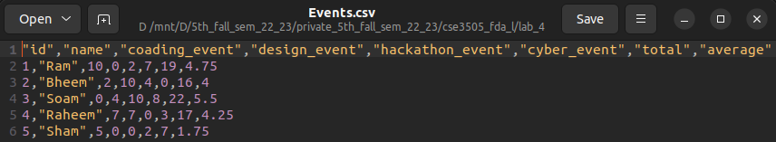

1. Create a list to maintain the details of a student such as registration number, name, no. of courses registered and marks in each subject.
```{r}
studentDetails <-
  list(
    regNo = c('20BCE1025', '19BAI1223', '21EEE7899'),
    name = c('Abhishek', 'Ram', 'Bheem'),
    courses = c('Physics', 'Chemistry', 'Mathematics'),
    marks = matrix(
      c(98, 99, 95, 43, 28, 70, 23, 78, 76),
      nrow = 3,
      ncol = 3,
      byrow = TRUE
    )
  )
studentDetails
```
2. Retrieve the name of the students.
```{r}
studentDetails$name
```
3. Extract only the registration number and the marks of the students.
```{r}
studentDetails[c(1,4)]
```
4. Access the mark in the first course registered.
```{r}
studentDetails$marks[,1]
```
5. Modify the mark entry in the last course as 5 more than the existing mark.
```{r}
studentDetails$marks[, 3] <- (studentDetails$marks[, 3] + 5)
studentDetails$marks
```
***
Q. A college has conducted technical events for the students. It maintains the name of the participant and the score obtained in different events.

1. Create a data frame by considering 5 students and 4 events. Each event has a maximum score of 10. If a student participates in an event, its entry contains the score value and 0 otherwise.
```{r}
eventScore <- data.frame(
  id = c(1:5),
  name = c('Ram', 'Bheem', 'Soam', 'Raheem', 'Sham'),
  coading_event = c(10, 2, 0, 7, 5),
  design_event = c(0, 10, 4, 7, 0),
  hackathon_event = c(2, 4, 10, 0, 0),
  cyber_event = c(7, 0, 8, 3, 2)
)
```
2. View the contents of the data frame.
```{r}
eventScore
```
3. Find the total score of each participant.
```{r}
total<-apply(eventScore[,3:6], 1, sum)
total
```
4. Append a column to include the total score of the participants and view the data frame.
```{r}
eventScore$total=total
eventScore
```
5. Find the maximum score and display the name of the participant who scored it.
```{r}
max_score<-apply(eventScore[,3:6],2,max)
max_score
max_score_index<-apply(eventScore[,3:6] , 2, which.max)
eventScore[max_score_index,2]
```
6. Compute the average score of each events and append it as a new row in the data frame.
```{r}
eventScore$average<-apply(eventScore[,3:6], 1, mean)
eventScore
```
7. Store the details in a comma separated values (csv) file. Also suppress the row numbers.
```{r}
# I am using linux so file path formats are different
write.csv(eventScore,"./Events.csv", row.names = FALSE)
```

8. Read the content of ‘Events.csv’ in a data frame and view it.
```{r}
eventScore2<-read.csv("./Events.csv")
eventScore2
```
9. Access the scores of participants in event2 using the column name.
```{r}
eventScore2["design_event"]
```
10. Use index number to retrieve the same data.
```{r}
eventScore2[4]
```
11. Extract the score of third participant in event3.
```{r}
eventScore2[3,5]
```
12. Extract the scores of the first and second participant in all the events.
```{r}
eventScore[1:2,1:6]
```
13. Display the names and total scores of all participants.
```{r}
eventScore[,c(2,7)]
```
14. Make the column “name” as the row index of the data frame.
```{r}
rownames(eventScore2)<-eventScore$name
eventScore2
```
15. Display the names of the students participated in event3.
```{r}
subset(eventScore2, hackathon_event>0, select = name)
```
16. Obtain the names whose total score is above its average.
```{r}
total_avg=mean(eventScore2$total)
total_avg
subset(eventScore2, total>total_avg, select = name)
```


